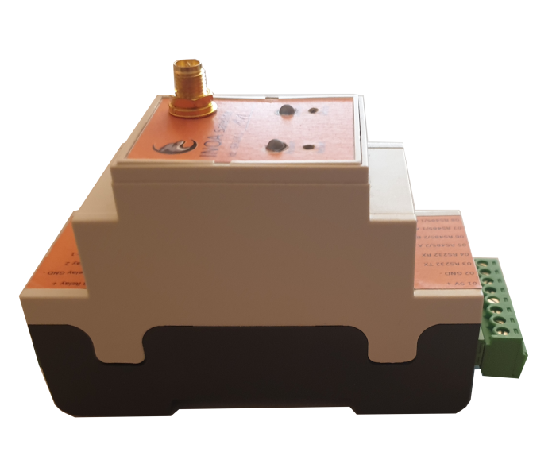
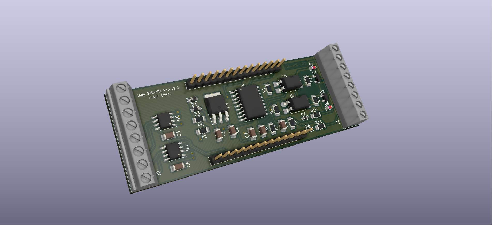
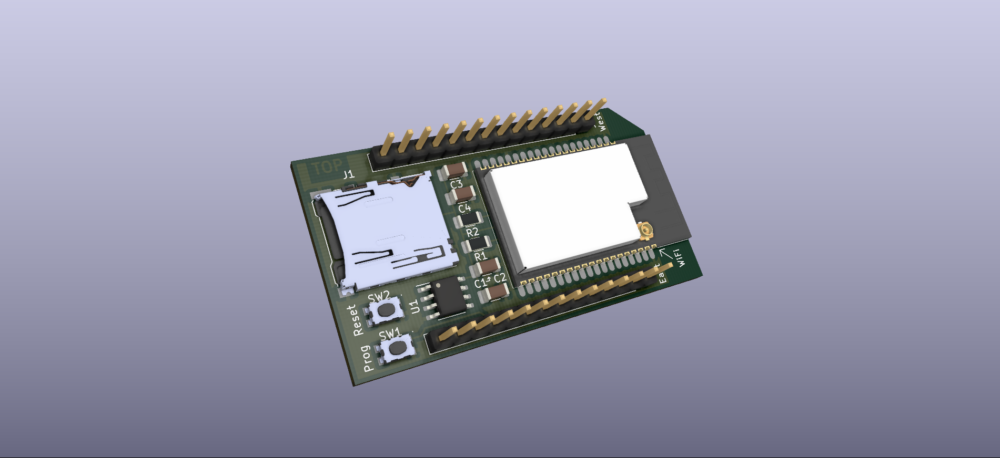
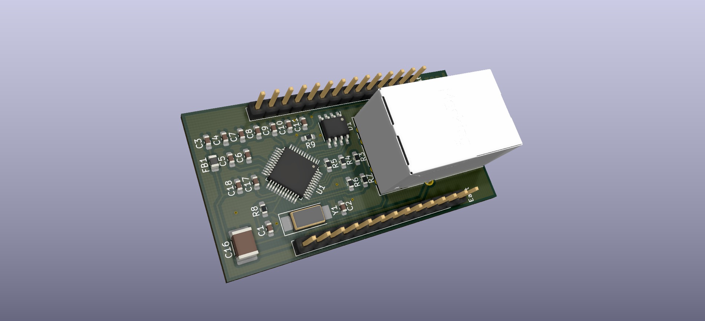
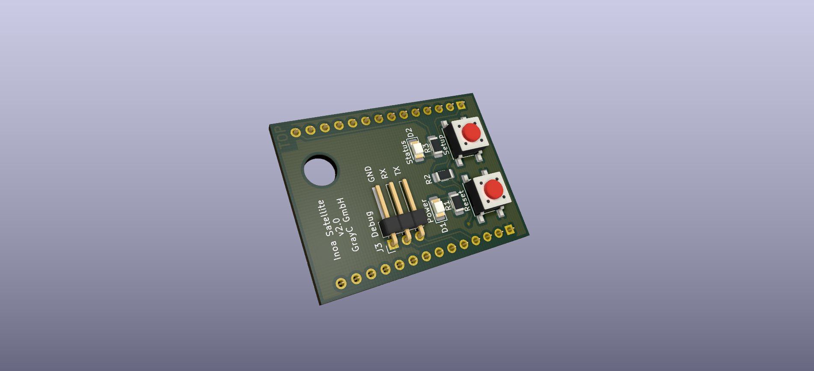

# Inoa Satellite

The Inoa Satellite is an open hardware project for building a metering / gateway device meant for an industrial environment.

## Why?

There are a huge amount of IoT gateways out there, but none of these fulfill completely all of our design goals:
* Usage in a rough industrial environment
* Hardware driven security (HSM)
* Cheap hardware to be able to finance a huge fleet of devices
* Low energy consumption due to possible battery driven usage
* Small casing (DIN rail) to allow mounting in existing fuse boxes
* Extendable design to be future proof
* Modular design to adapt hardware to use cases and keep costs low

## How?

We use [KiCad](https://www.kicad.org/) for our PCB designs [Parts Community](https://b2b.partcommunity.com/) and [SnapEDA](https://www.snapeda.com/) for symbols, footprints, models 'n stuff...

To meet our design goals, we decided to:
* Use the ESP32-WROVER-IE module with 16MB Flash and 8MB RAM
* Use the ATECC608A chip as HSM
* Choose industrial proof parts, shielding and ESD protection
* Pick a certified DIN rail casing
* Cut the design to several stacked modules

## Modules

### General

The Satellite comes with a stacked design allowing to interchange the modules on each level of the stack to fit the needs of its planned duty.

This allows quick and cheap adjustment of single devices, ensures extendability, keeps costs low and offers replacement of defect modules with spare parts.

The Satellite consists of up to 4 levels (level 1 is the bottom). Level 3 is an optional level and may be left out.

* Level 1 holds the power supply and metering / control peripheries.
* Level 2 is the main module for the micro controller
* Level 3 is the network / communication level (Ethernet, NB IoT, LoRa, ...)
* Level 4 is meant for the user panel

### Metering Modules

#### Electric Metering Module

The electric metering module is dedicated to be used for interacting with electric meters, inverters, batteries and so on. It is a base module on level 1 of the stack. Its features are:

* 4V-24V power input
* PE / Shield pin
* 2x RS485 interface (used for e.g. ModBus, ...)
* 2x pulse interface (S0, Photoelectric barrier, ...)
* 2x relay driver

#### Current Loop Metering Module

_**Coming soon**_

#### MBus / WMBus Metering Module

_**Coming soon**_

### SoC Module

The SoC module is the heart of the satellite and home of the microprocessor, flash memory and HSM (hardware security module). It is the main module on level 2 of the stack. Its features are:

* ESP32 MPU (32 Bit, Dual Core, 240 MHz)
* 8 MB RAM
* 16 MB flash
* µSD Card slot for external storage
* HSM (ATECC608)

### Ethernet Module

The ethernet module connects the Satellite to ethernet. It is a network module on level 3 of the stack. Its features are:

* W5500 ethernet chip (MAC+PHY)
* ESD protection
* Shielded RJ45 plug

### NB IoT Module

_**Coming soon**_

### LoRa Module

_**Coming soon**_

### Panel Module

The panel module is the "user interface" and home of all user input output devices of the Satellite. It is the top module on level 4. Its features are:

* Power and status LED
* Reset and setup button
* 128x64 OLED display (optional)
* RS232 Debug interface
* External WiFi antenna (optional)

## Casings

We use a DIN rail mounted casing in 2 FE width. See [Datasheet](./casing/rail/apra_rail_Leiterkartengroessen_PCB_Dimensions_de_en.pdf) for details.

## Development

### Building the Project

You will need:

* Python >= 3.8
* KiCad Export (see [installation instructions](https://github.com/nerdyscout/kicad-exports#installation))

Clone this project and run `./build.sh`. You will get a selection of the possible modules to be built.

### Project structure

| Folder               | Purpose |
|----------------------|---------|
| ./casing             | Construction files for the casing          |
| ./configs            | KiCad-Export configuration                 |
| ./development-board  | Design for the development board           |
| ./docs               | Documentation                              |
| ./ethernet-extension | Design for the ethernet module             |
| ./libraries          | Electric symbols, footprints and 3D models |
| ./metering-module    | Design for the metering module             |
| ./nbiot-extension    | Design for the NB IoT module               |
| ./out                | Build output folder                        |
| ./panel-module       | Design for the panel module                |
| ./soc-module         | Design for the SoC module                  |

### Conventions

* Each PCB has an etched label for "TOP" and "BOT" marks
* Each PCB has an etched label for the product serial following the pattern: SR-XX-NNN (e.g. SR-SM-021)
* The product serial start with "SR" for "Satellite Rail", the next two characters are reserved for the module, the 3 digits represents the version

| Serial    | Module / Part          | Current Version |
|-----------|------------------------|-----------------|
| SR-SC-XXX | SoC Module             | v2.0            |
| SR-EM-XXX | Electric Metering      | v2.0            |
| SR-CM-XXX | Current Loop Metering  | v2.0            |
| SR-MM-XXX | MBus / WMBus Metering  | v2.0            |
| SR-ET-XXX | Ethernet Module        | v2.0            |
| SR-NB-XXX | NB IoT Module          | v2.0            |
| SR-LR-XXX | LoRa / LoRa WAN Module | v2.0            |
| SR-PN-XXX | Panel Module           | v2.0            |

## Pin Out

| Pin ESP | Pin Satellite | Pin Name  | Standard Purpose     |
|---------|---------------|-----------|----------------------|
| 1       | East 1        | GND       | Ground               |
| 2       | West 1        | 3V3       | Power supply         |
| 3       | West 2        | EN3       | Reset                |
| 4       | West 3        | I36       |                      |
| 5       | West 4        | I39       |                      |
| 6       | West 5        | I34       |                      |
| 7       | West 6        | I35       |                      |
| 8       | West 7        | IO32      |                      |
| 9       | West 8        | IO33      |                      |
| 10      | West 9        | IO25      |                      |
| 11      | West 10       | IO26      |                      |
| 12      | West 11       | IO27      |                      |
| 13      | West 12       | IO14      |                      |
| 14      | West 13       | IO12      |                      |
| 15      | NC            | GND       | Ground               |
| 16      | West 14       | IO13      | Status LED           |
| 17      | NC            | NC        | Internal Flash / RAM |
| 18      | NC            | NC        | Internal Flash / RAM |
| 19      | NC            | NC        | Internal Flash / RAM |
| 20      | NC            | NC        | Internal Flash / RAM |
| 21      | NC            | NC        | Internal Flash / RAM |
| 22      | NC            | NC        | Internal Flash / RAM |
| 23      | East 14       | IO15      |                      |
| 24      | East 13       | IO2       |                      |
| 25      | East 12       | IO0       | Setup Button         |
| 26      | East 11       | IO4       |                      |
| 27      | NC            | NC        | Internal Flash / RAM |
| 28      | NC            | NC        | Internal Flash / RAM |
| 29      | East 9        | IO5       | SPI 1 CS (SD)        |
| 30      | East 8        | IO18      | SPI 1 CLK            |
| 31      | East 7        | IO19      | SPI 1 MISO           |
| 32      | NC            | NC        | Internal Flash / RAM |
| 33      | East 6        | IO21      | I2C SDA              |
| 34      | East 5        | URXD0     | UART 0 RX            |
| 35      | East 4        | UTXD0     | UART 0 TX            |
| 36      | East 3        | IO22      | I2C SCL              |
| 37      | East 2        | IO23      | SPI 1 MOSI           |
| 38      | East 1        | GND       | Ground               |