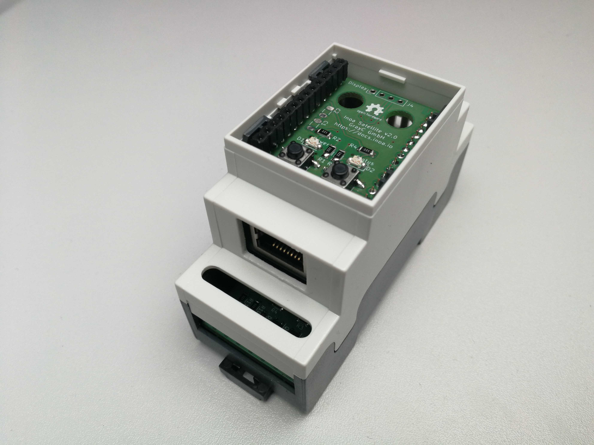
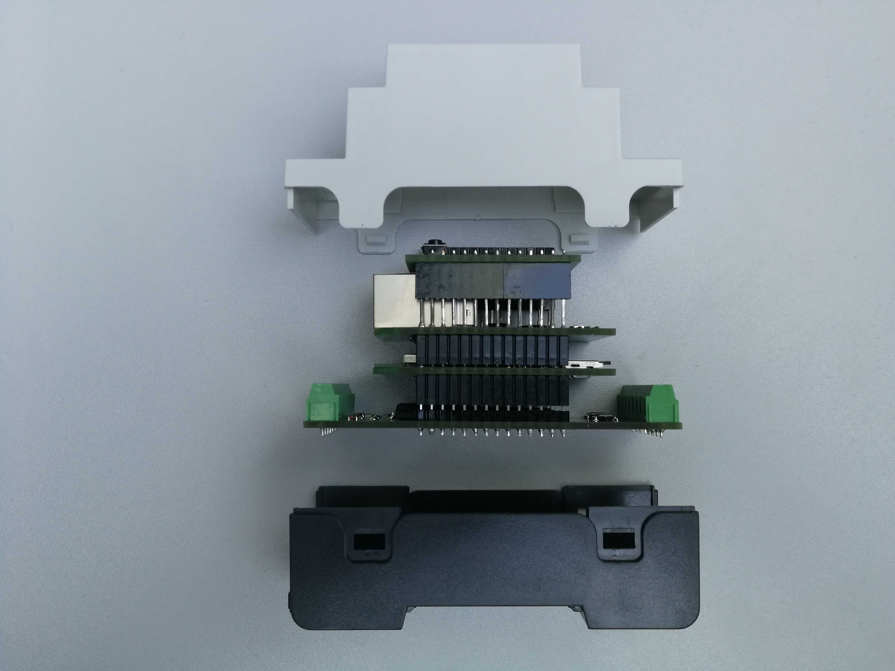
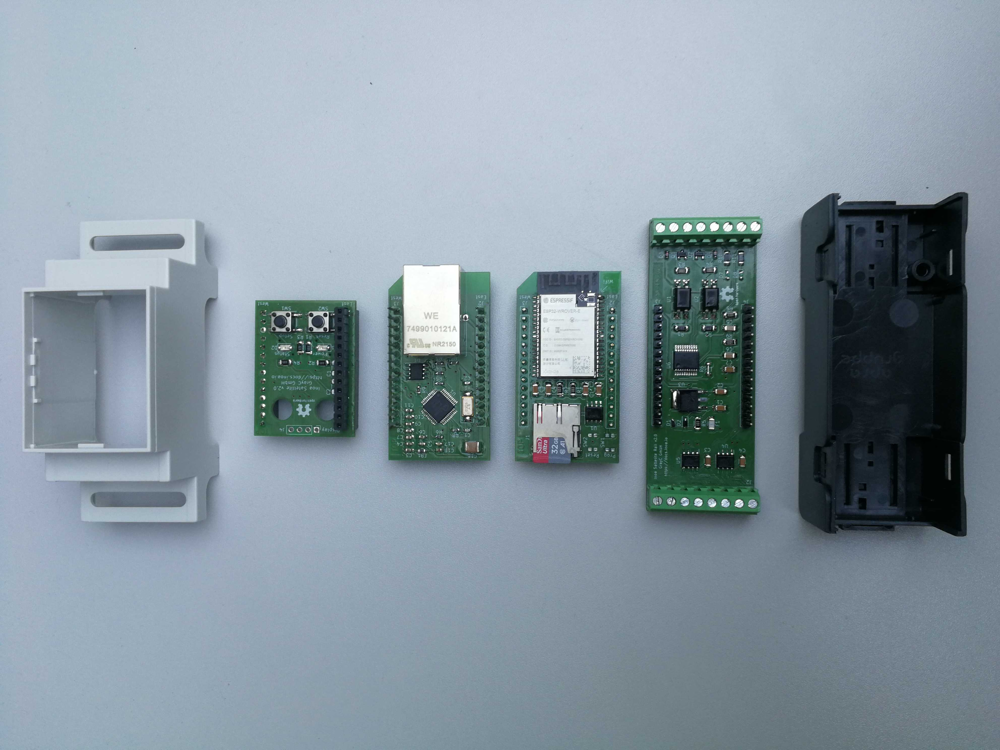

# Inoa Satellite Gateway

## General

The Inoa Satellite is a lightweight and secure gateway for your fuse box or industrial environment with a DIN rail mounted casing which is 2 FE wide.

It features an ESP32 MPU with 240MHz dual core, 8MB Ram, 16MB program flash and a SD card slot for SSD usage.

## Design Goals

* Usage in a rough industrial environment
* Hardware driven security (HSM)
* Cheap hardware to be able to finance a huge fleet of devices
* Low energy consumption due to possible battery driven usage
* Fuse box casing (DIN rail)
* Small (2 FE / 36mm) to allow mounting in existing fuse boxes
* Extendable design to be future proof
* Modular design to adapt hardware to use cases and keep costs low

## Modular Desgin

The Satellite comes with a stacked design allowing to interchange the modules on each level of the stack to fit the needs of its planned duty.

This allows quick and cheap adjustment of single devices, ensures extendability, keeps costs low and offers replacement of defect modules with spare parts.

The Satellite consists of up to 4 levels (level 1 is the bottom). Level 3 is an optional level and may be left out.

* Level 1 holds the power supply and metering / control peripheries.
* Level 2 is the main module for the micro controller
* Level 3 is the network / communication level (Ethernet, NB IoT, LoRa, ...)
* Level 4 is meant for the user panel or other external I/O interfaces

