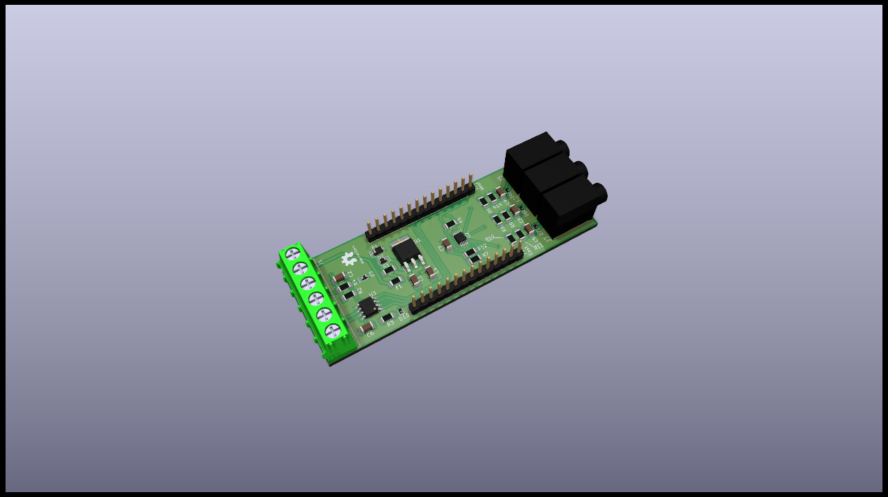

# CT Module

## Specifications

The CT module is dedicated to be used for EMS use cases. Current transformers (split core) with voltage output may be used (e.g. SCT-013).

It is a base module on level 1 of the stack. Its features are:

* 5V-24V power input
* 3x CT
* 1x Analog in (ADC)
* 1x Digital in (e.g. S0 meters)
* 1x RS485 interface (ModBus RTU meters)

## Schematics

## Resources

* [PCB Top](../generated/pcb/ct-module-F_Cu.svg)
* [PCB Bottom](../generated/pcb/ct-module-B_Cu.svg)
* [Bill of material](../generated/bom/ct-module-bom.csv)
