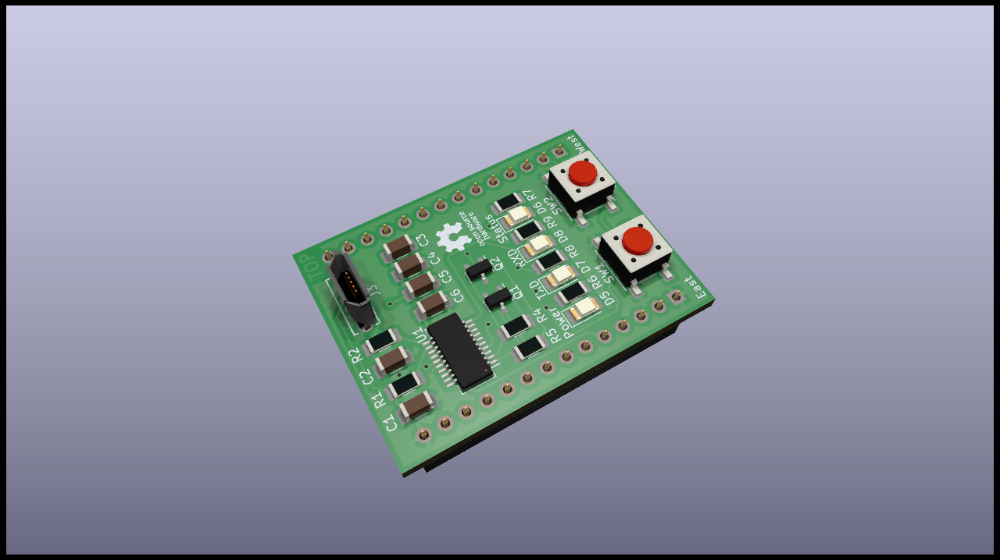

# Debug Module

## Specifications

The Debug module is a tool to debug Satellites at its installation place. The panel module is removed and the debug module is put at its place instead. The module has an USB connection that will power the Satellite when plugged in. Also, the module has an onboard USB to UART adapter, so the Satellites' debug console can be used directly via USB.

## Schematics

## Resources

* [PCB Top](../generated/pcb/debug-module-F_Cu.svg)
* [PCB Bottom](../generated/pcb/debug-module-B_Cu.svg)
* [Bill of material](../generated/bom/debug-module-bom.csv)
