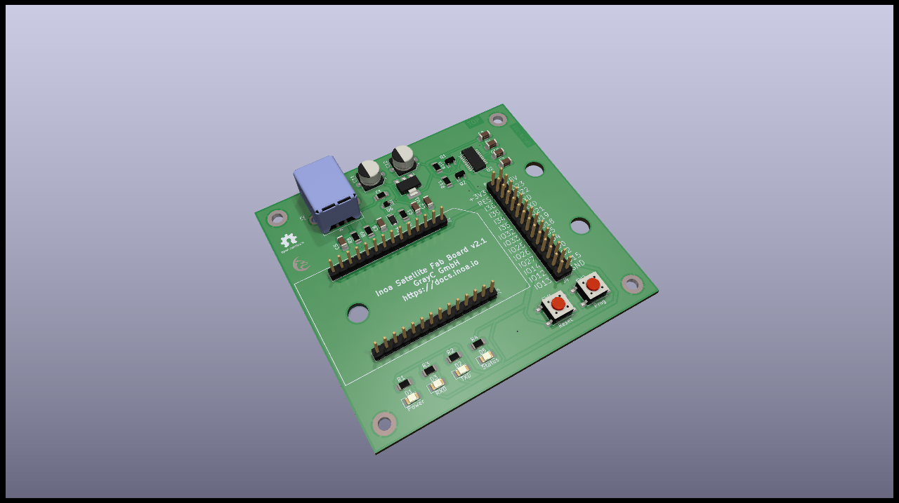

# Development Board

## Specifications

The Development Board is a tool to flash, debug and develop new Satellite modules. Any Satellite module can be connected to the board. Even a whole stack (SoC, networtk and panel module) can be used. The module has an USB connection that will power the connected modules when plugged in. Also, the module has an onboard USB to UART adapter, so the Satellites' debug console can be used directly via USB. The board has an auto programmer circuit, so connected SoC modules can be automatically flashed from the host PC. For further development, there is also a pin header providing the complete system bus.

## Schematics

## Resources

* [PCB Top](../generated/pcb/development-board-F_Cu.svg)
* [PCB Bottom](../generated/pcb/development-board-B_Cu.svg)
* [Bill of material](../generated/bom/development-board-bom.csv)
