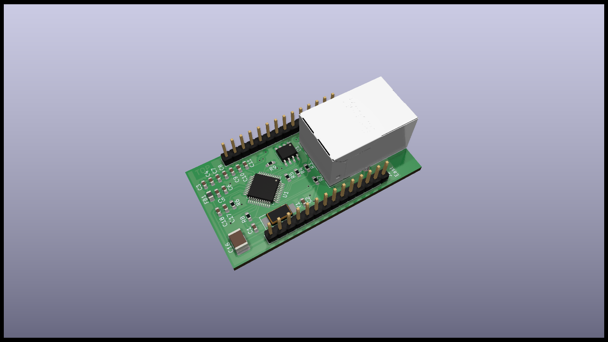

# Ethernet Module

## Specifications

The Ethernet module connects the Satellite to Ethernet. It is a network module on level 3 of the stack. Its features are:

* W5500 Ethernet chip (MAC+PHY)
* ESD protection
* Shielded RJ45 plug

## Schematics

## Resources

* [PCB Top](../generated/pcb/ethernet-extension-F_Cu.svg)
* [PCB Bottom](../generated/pcb/ethernet-extension-B_Cu.svg)
* [Bill of material](../generated/bom/ethernet-extension-bom.csv)
