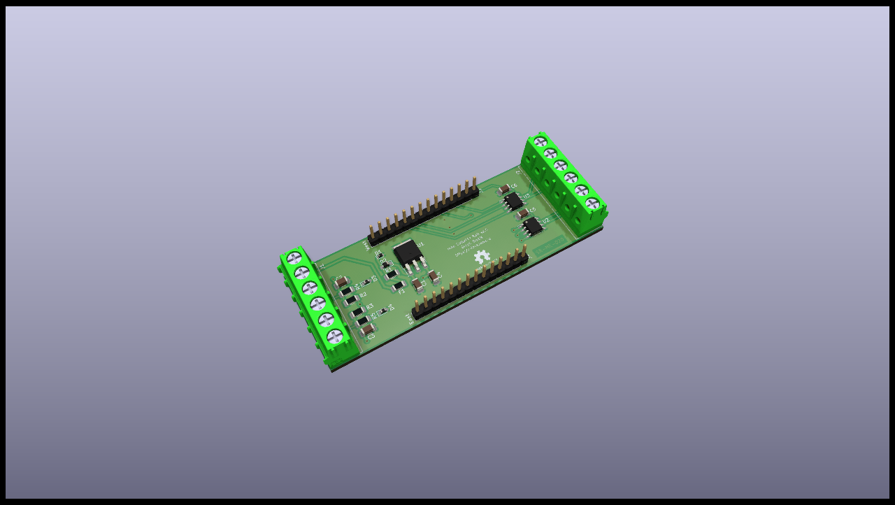

# Mieterstrom Module

## Specifications

The Mieterstrom module is dedicated to be used for interacting with electric meters in a tenement environment. In this case, there are different types of meters used and so a need of different bus speeds may needed.

It is a base module on level 1 of the stack. Its features are:

* 5V-24V power input
* 2x RS485 interface (ModBus RTU meters)
* 2x pulse interface (S0 meters)
* PE / Shield pins for bus connections

## Schematics

## Resources

* [PCB Top](../generated/pcb/mieterstrom-module-F_Cu.svg)
* [PCB Bottom](../generated/pcb/mieterstrom-module-B_Cu.svg)
* [Bill of material](../generated/bom/mieterstrom-module-bom.csv)
