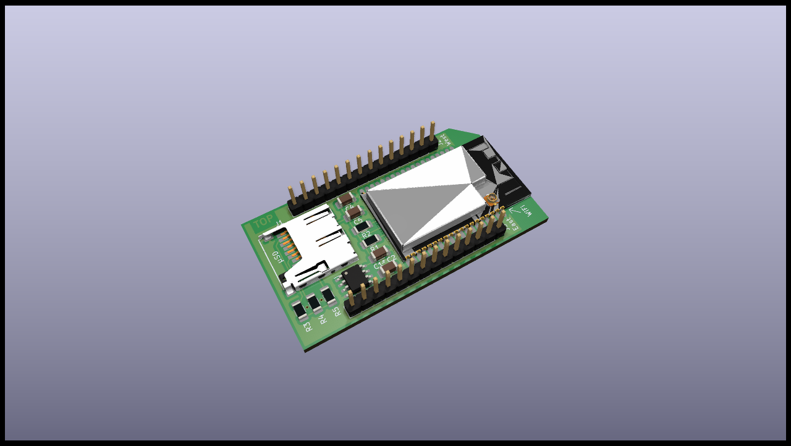

# SoC Module

## Specifications

The SoC module is the heart of the Satellite and home of the microprocessor, flash memory and HSM (hardware security module). It is the main module on level 2 of the stack. Its features are:

* ESP32 MPU (32 Bit, Dual Core, 240 MHz)
* 8 MB RAM
* 16 MB flash
* µSD Card slot for external storage
* HSM (ATECC608)
* RTC (DS3231)

## Schematics

## Resources

* [PCB Top](../generated/pcb/soc-module-F_Cu.svg)
* [PCB Bottom](../generated/pcb/soc-module-B_Cu.svg)
* [Bill of material](../generated/bom/soc-module-bom.csv)
