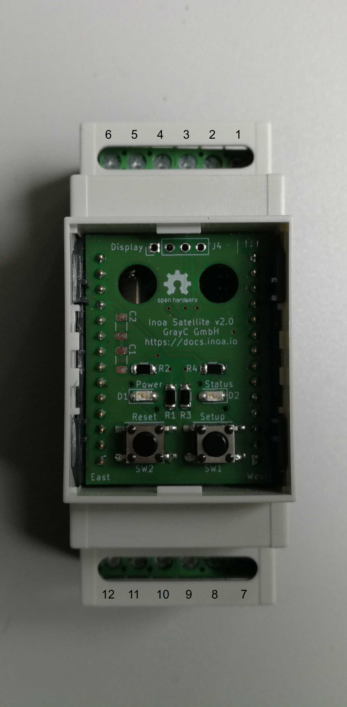
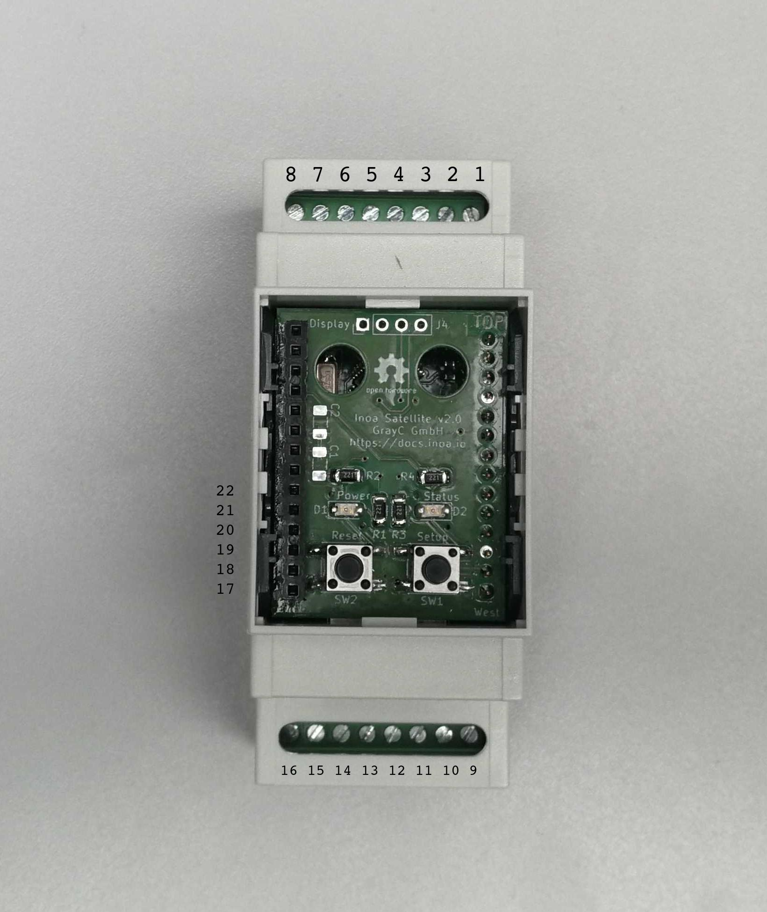

# Electrical Installation

The electrical installation may differ based on the metering module of the satellite. Some modules might have other pin connection based on the provided interfaces (e.g. ModBus, CAN, KNX, ...).

Please find the installation instructions for your specific model below.

## General

All Satellite "Rail" models are meant to be mounted on a DIN rail at indoor sites. For outdoor usage please refer to the Satellite "Probe" models.

All models uses internal micro SD cards as file storage. You can insert an SD card of your choice by opening the case popping the 4 latches out with a screw driver. The card can be inserted at the upper side of the PCB "sandwich".

## Tenant Electricity Model

The metering model is able to connect to 2 different RS485 buses (e.g. ModBus) running on different baud rates. It is also fitted with 2 digital inputs (e.g. S0).

Please find to pin out below:

| Pin | Purpose       | Description                                            |
|-----|---------------|--------------------------------------------------------|
| 1   | +5-24V        | Power supply positive 5 to 24 volts, >=3W              |
| 2   | Ground        | Power supply ground                                    |
| 3   | S0 1 +        | S0 interface                                           |
| 4   | S0 1 -        | S0 interface                                           |
| 5   | S0 2 +        | S0 interface                                           |
| 6   | S0 2 -        | S0 interface                                           |
| 7   | RS485 1-B     | RS485 1 "B" line                                       |
| 8   | RS485 1-A     | RS485 1 "A" line                                       |
| 9   | RS485 1-GND   | RS485 1 Ground line (shield)                           |
| 10  | RS485 2-B     | RS485 2 "B" line                                       |
| 11  | RS485 2-A     | RS485 2 "A" line                                       |
| 12  | RS485 2-GND   | RS485 2 Ground line (shield)                           |

Connect Pin 1 and 2 to a power supply delivering 5 to 24 volts. Be aware that the best efficiency is achieved with 5 volts. Higher voltages will lead to higher thermal loss. The power supply must be rated for at least 3W.

Connect the RS485 pins as described in the table. Be sure to connect the shield of the RS485 buses to ground pin to avoid stability problems. The Satellite does **not** have internal termination resistors!

The S0 pins should be connected to a S0 device, reed contact, incremental wind sensor, and any other device that uses a simple switch inside.

## M-Bus Model

The M-Bus model is able to connect to a RS485 bus (e.g. ModBus) and also acts as M-Bus master. It is also fitted with 2 digital inputs (e.g. S0).

Please find to pin out below:

| Pin | Purpose       | Description                                            |
|-----|---------------|--------------------------------------------------------|
| 1   | +5-24V        | Power supply positive 5 to 24 volts, >=3W              |
| 2   | Ground        | Power supply ground                                    |
| 3   | S0 1 +        | S0 interface                                           |
| 4   | S0 1 -        | S0 interface                                           |
| 5   | S0 2 +        | S0 interface                                           |
| 6   | S0 2 -        | S0 interface                                           |
| 7   | RS485 1-B     | RS485 1 "B" line                                       |
| 8   | RS485 1-A     | RS485 1 "A" line                                       |
| 9   | M-Bus M-      | M-Bus negative bus line                                |
| 10  | M-Bus M+      | M-Bus positive bus line                                |
| 11  | M-Bus DC-     | M-Bus power supply 9-30V (-)                           |
| 12  | M-Bus DC+     | M-Bus power supply 9-30V (+)                           |

Connect Pin 1 and 2 to a power supply delivering 5 to 24 volts. Be aware that the best efficiency is achieved with 5 volts. Higher voltages will lead to higher thermal loss. The power supply must be rated for at least 3W.

Connect the RS485 pins as described in the table. Be sure to connect the shield of the RS485 bus to ground pin to avoid stability problems. The Satellite does **not** have internal termination resistors!

The S0 pins should be connected to a S0 device, reed contact, incremental wind sensor, and any other device that uses a simple switch inside.

Pin 9 and 10 acts as M-Bus data line. Connect the M-Bus power supply to pin 11 and 12. Be sure to use the correct polarity! The power supply drives the M-Bus, so choose a fitting one depending on the number of connected meters.

## Electric Metering Model

The metering model is able to connect to 2 different RS485 buses (e.g. ModBus) running on different baud rates. It is also able to drive 2 relays and to connect to 2 digital inputs (e.g. S0).

Please find to pin out below:

| Pin | Purpose       | Description                                            |
|-----|---------------|--------------------------------------------------------|
| 1   | +5-24V        | Power supply positive 5 to 24 volts                    |
| 2   | Ground        | Power supply ground                                    |
| 3   | Shield        | Connect to earth                                       |
| 4   | shield        | Connect to earth                                       |
| 5   | RS485 1-A     | RS485 "A" line                                         |
| 6   | RS485 1-B     | RS485 "B" line                                         |
| 7   | RS485 2-A     | RS485 "A" line                                         |
| 8   | RS485 2-B     | RS485 "B" line                                         |
| 9   | Relay Power + | Power supply for relays positive (e.g. 12 or 24 volts) |
| 10  | Relay Power - | Power supply for relays ground                         |
| 11  | Relay 1       | Relay switch (will become negative if switched)        |
| 12  | Relay 2       | Relay switch (will become negative if switched)        |
| 13  | S0 1 +        | S0 interface                                           |
| 14  | S0 1 -        | S0 interface                                           |
| 15  | S0 2 +        | S0 interface                                           |
| 16  | S0 2 -        | S0 interface                                           |
| 17  | Ground        | Power supply ground                                    |
| 18  | Do not use    | Do not use (future use for internal SD)                |
| 19  | I²C SCL       | External I²C                                           |
| 20  | Debug UART TX | Debug console                                          |
| 21  | Debug UART RX | Debug console                                          |
| 22  | I²C SDA       | External I²C                                           |
| >22 | Do not use    | Do not use (future use for internal SD)                |

Connect Pin 1 and 2 to a power supply delivering 5 to 24 volts. Be aware that the best efficiency is achieved with 5 volts. Higher voltages will lead to higher thermal loss. The power supply must be rated for at least 3W.

Connect the RS485 pins as described in the table. Be sure to connect the shield of the RS485 bus to pin 3 or 4 to avoid stability problems. The Satellite does **not** have internal termination resistors!

The S0 pins should be connected to a S0 device, reed contact, incremental wind sensor, and any other device that uses a simple switch inside.

The relay power contacts have to be connected to an external power source. You might use the same power supply as used for the Satellite itself - depending on the voltage ratings of the used relay. Connect one positive wire of the power supply to your relay positive input. The negative input of the relay is connected to one of the switch pins 11 or 12.

## Debug console

All Satellite models can be debugged using an USB to UART adapter like the FT232. Connect the adapter to your PC. Connect the TX line to pin 20 and the RX line to pin 21. You also have to connect the ground line to pin 17.

Use a terminal tool of your choice, e.g. [GTKTerm](https://github.com/Jeija/gtkterm). Set the baud rate to 115200 and the bit configuration to 8N1.

Please refer to the developer guide for further information about dealing with the debug console!
